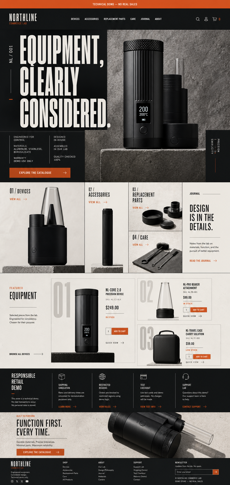

# Northline Commerce Lab

> A fictional, no-sales WooCommerce engineering demo. No real products, payments, customer data, or regulatory-compliance claims are involved.



Implementation evidence: [desktop storefront](docs/screenshots/homepage-desktop.png), [mobile storefront](docs/screenshots/homepage-mobile.png), and [product detail](docs/screenshots/product-desktop.png).

Northline Commerce Lab is a reproducible WooCommerce portfolio project built to demonstrate both customer-facing delivery and day-to-day store operations. It covers catalog management, variable products, inventory, coupons, shipping, Checkout Blocks, order handling, safe custom extension development, automated testing, and a disposable WordPress Playground demo.

**Status:** implementation in progress. The design direction and architecture are approved; the public Playground release will be linked here at `v1.0.0`.

**Cost policy:** the project must remain usable for CAD/USD/JPY 0. No paid hosting, payment gateway, email provider, metered API, premium plugin/theme, larger GitHub runner, or billable CI storage is permitted. See [zero-cost policy](docs/zero-cost-policy.md).

## Quick start

Requirements: Docker Desktop, Node.js 22, npm, Composer, and PHP 8.3.

```bash
npm install
composer install
npm run env:start
npm run setup
```

Storefront: `http://localhost:8888`  
Administrator: `http://localhost:8888/wp-admin` (`admin` / `password` in local disposable environments only)

Useful commands:

```bash
npm run lint
npm test
npm run playground:build
npm run env:stop
```

## What this proves

- A store can be rebuilt from source without committing a database dump.
- Products, attributes, stock states, pages, coupons, and shipping rules are seeded through WP-CLI and WooCommerce CRUD APIs.
- Restricted-product notices and regional rules are validated on the server and snapshotted into order items.
- The custom plugin sanitizes input, escapes output, verifies nonces and capabilities, and declares HPOS compatibility.
- Store content remains editable by non-developers through WordPress and WooCommerce administration.
- GitHub Flow, CI, architecture decisions, threat modeling, operations guides, and release evidence are part of the deliverable.

## Architecture

```text
wp-env / Docker / MySQL
        |
        +-- WordPress 7.0.1
        |     +-- Northline Storefront block theme
        |     +-- WooCommerce 10.9.4
        |     +-- Northline Commerce Rules plugin
        |
        +-- WP-CLI seed command (repeatable demo data)
        +-- PHPUnit + Playwright + axe
        +-- versioned Playground bundle
```

See [requirements](docs/requirements.md), [implementation flow](docs/implementation-flow.md), [design system](docs/design-system.md), [architecture](docs/architecture.md), [testing](docs/testing.md), [store operations](docs/operations/store-management.md), [release/recovery](docs/operations/release-recovery.md), and [threat model](docs/threat-model.md).

## 日本語要約

Northline Commerce Labは、架空の商品だけを扱う販売機能のないWooCommerce技術デモです。商品・在庫・可変商品・クーポン・配送・Checkout Block・注文運用に加え、安全な独自プラグイン開発、WP-CLIによる再構築、テスト、Playground公開までを一つのPublic GitHubリポジトリで説明します。

本プロジェクトは法令適合製品ではありません。実在の商品、ブランド、決済情報、顧客情報を使用せず、単純な年齢確認を法令対応済みとは表現しません。

費用は0円を必須条件とし、有料ホスティング、実決済、有料メール、従量課金API、プレミアムテーマ／プラグイン、有料GitHub runnerを使用しません。費用が必要になった機能は自動的に有効化せず、MVP対象外とします。

## License

Code is licensed under `GPL-2.0-or-later`. Asset provenance and licenses are recorded in [docs/asset-register.md](docs/asset-register.md).
